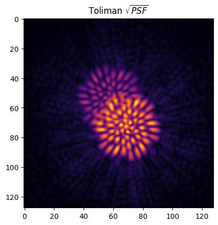

# dLuxToliman

[](https://badge.fury.io/py/dLuxToliman)
[](LICENSE)

## Description
This repository/package contains pre-built ∂Lux models of the Toliman optical system, and pre-built parametrised ∂Lux source objects for Alpha Centauri.

[∂Lux](https://louisdesdoigts.github.io/dLux/) is an open-source differentiable optical modelling framework harnessing the structural isomorphism between optical systems and neural networks, giving forwards models of optical system as a _parametric neural network_.
∂Lux is built in [Zodiax](https://github.com/LouisDesdoigts/zodiax) which is an open-source object-oriented [Jax](https://github.com/google/jax) framework built as an extension of [Equinox](https://github.com/patrick-kidger/equinox) for scientific programming.

The primary goal of the Toliman mission is to discover Earth-sized exoplanets orbiting in Alpha Centauri, the closest star system to our own.
To achieve this, the mission will employ a novel telescope design that will be able to detect subtle changes in the positions of the Alpha Centauri binary pair.
These changes are caused by the gravitational reflex motion induced by an Earth-sized companion, and this cutting-edge technology will enable scientists to identify exoplanets too small to be detected by conventional telescopes.
Toliman utilises a binary phase diffraction pupil to grasp the expected microarcsecond-scale astrometric signal.

## Installation

`dLuxToliman` is pip-installable. To install the latest release, simply run:

```bash
pip install dLuxToliman
```

## Usage

A very basic example of how to use this package is as follows:

```python
# imports
import dLuxToliman as dlT
from matplotlib import pyplot as plt

osys = dlT.TolimanOptics(psf_npixels=128, psf_oversample=1)  # creating Toliman optical system
source = dlT.AlphaCen(n_wavels=3, separation=8, position_angle=30)  # creating Alpha Centauri source
psf = osys.model(source)  # running optical simulation

# plotting
plt.imshow(psf ** .5, cmap='inferno')
plt.title('Toliman $\sqrt{PSF}$')
plt.show()
```



## Contributors
[Max Charles](https://github.com/maxecharles), [Louis Desdoigts](https://github.com/LouisDesdoigts), [Benjamin Pope](https://github.com/benjaminpope), and [Peter Tuthill](https://github.com/ptuthill).

## License

This package is released under the BSD 3-Clause License. See the [LICENSE](LICENSE) file for more information.

## Support

If you encounter any problems or have any questions related to Toliman models, please raise an issue or contact me at `max.charles@sydney.edu.au`.
